## 
<h2 align="center">Меня зовут Анастасия, я Frontend-разработчик</h2>

### 👩‍💻 Обо мне:
Мне нравится создавать удобные и интерактивные веб-сайты.

Я готова к новым вызовам и стремлюсь улучшать свои навыки, чтобы создавать качественные и функциональные решения для пользователей.

Защитила диплом [Frontend-разработчика](https://tusur-courses.ru/catalog/programmirovanie/frontend) в ТУСУР ("Томский государственный университет систем управления и радиоэлектроники"). Ежедневно практикуюсь в программировании, создаю проекты, изучаю JavaScript и фреймворки (React, Vue).

🎯 **Мои цели**:

- Писать чистый и поддерживаемый код;
- Работать в команде с увлеченными коллегами, разделяющими схожие ценности;
- Участвовать в интересных и значимых проектах;
- Вносить вклад в успех компании;
- Развивать навыки в современных технологиях и фреймворках.

### Связаться со мной

---

### 🛠 Языки и Технологии:
 
 

  

---

### 👨‍🎓 Образование:

|[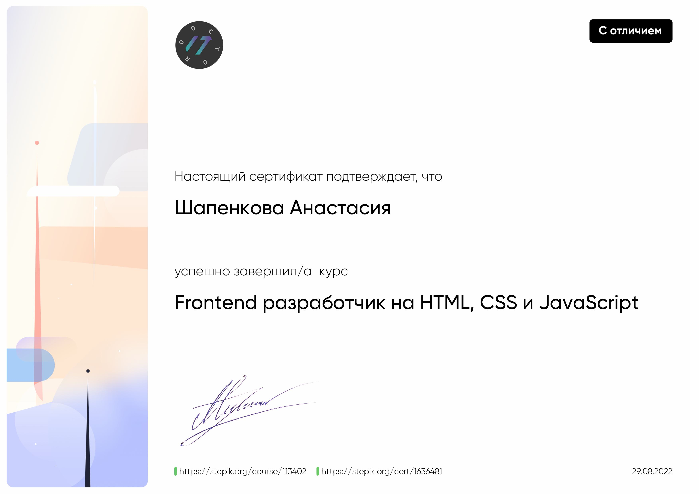](https://stepik.org/cert/1636481)|[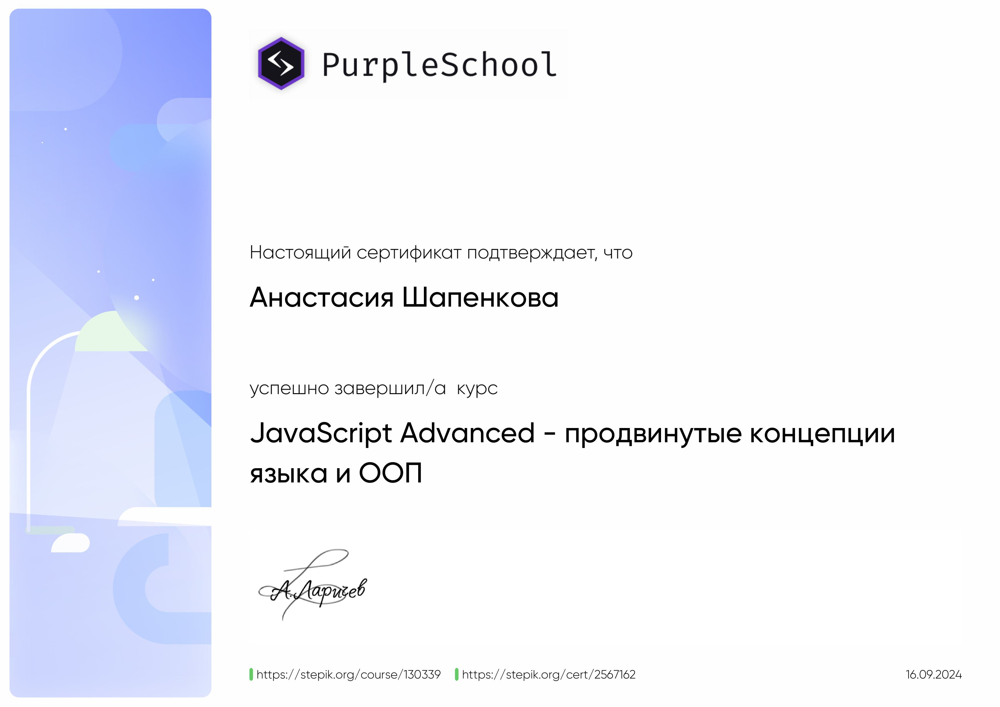](https://stepik.org/cert/2567162)|[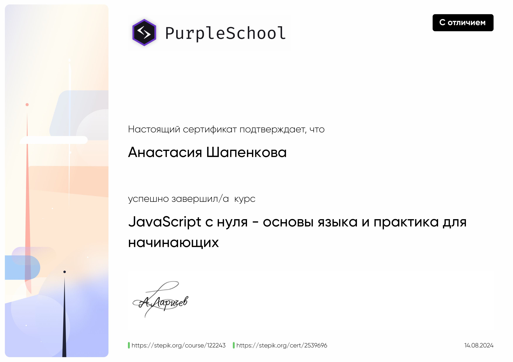](https://stepik.org/cert/2539696)|[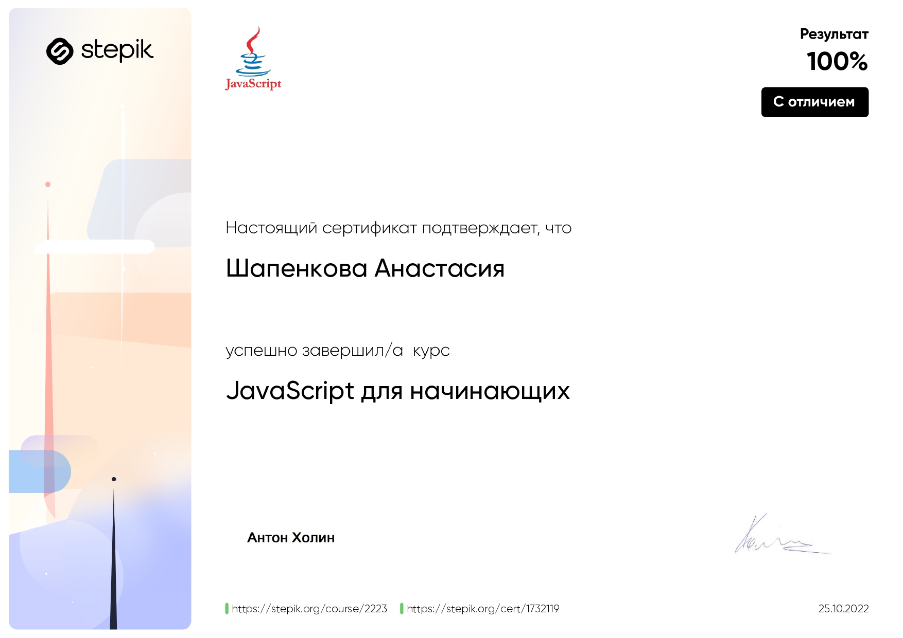](https://stepik.org/cert/1732119)
|:----:|:----:|:----:|:----:|
|[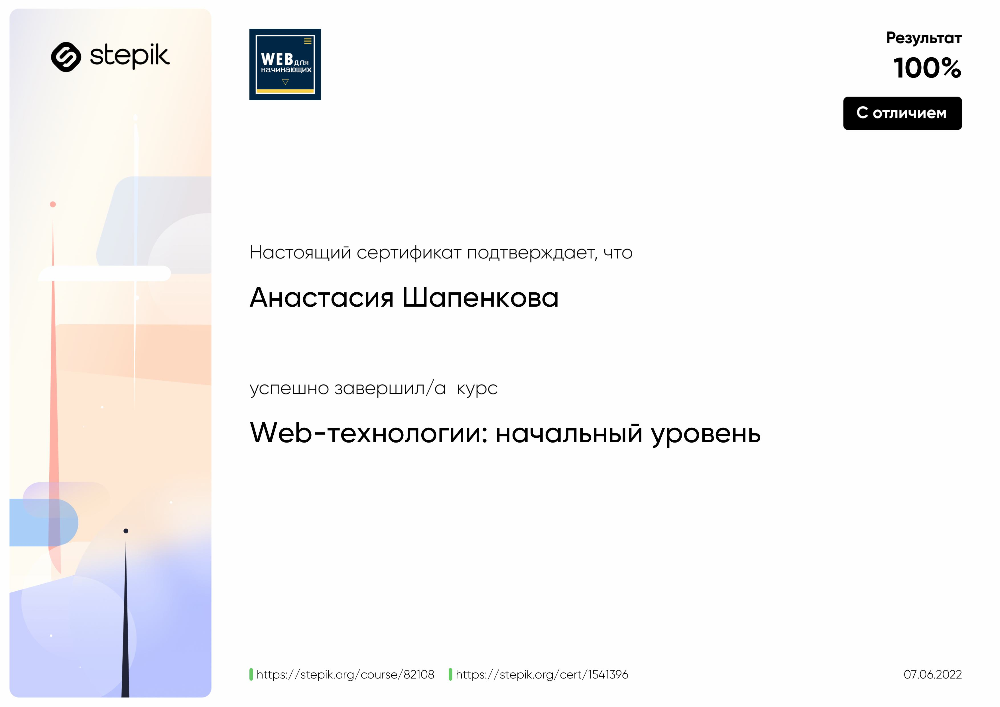](https://stepik.org/cert/1541396)|[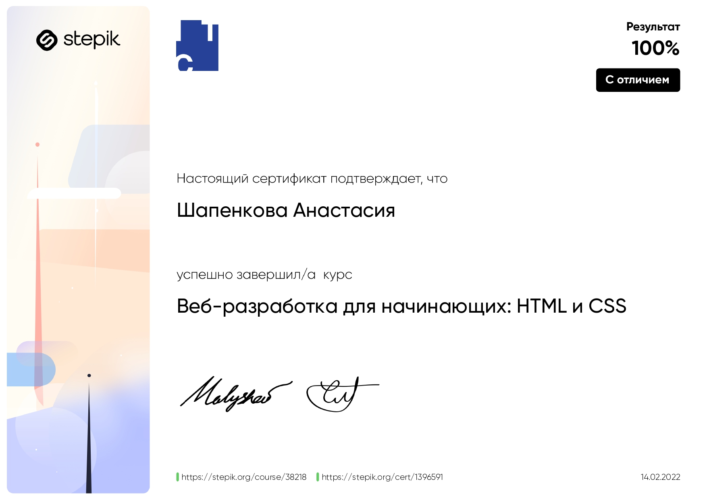](https://stepik.org/cert/1396591)|[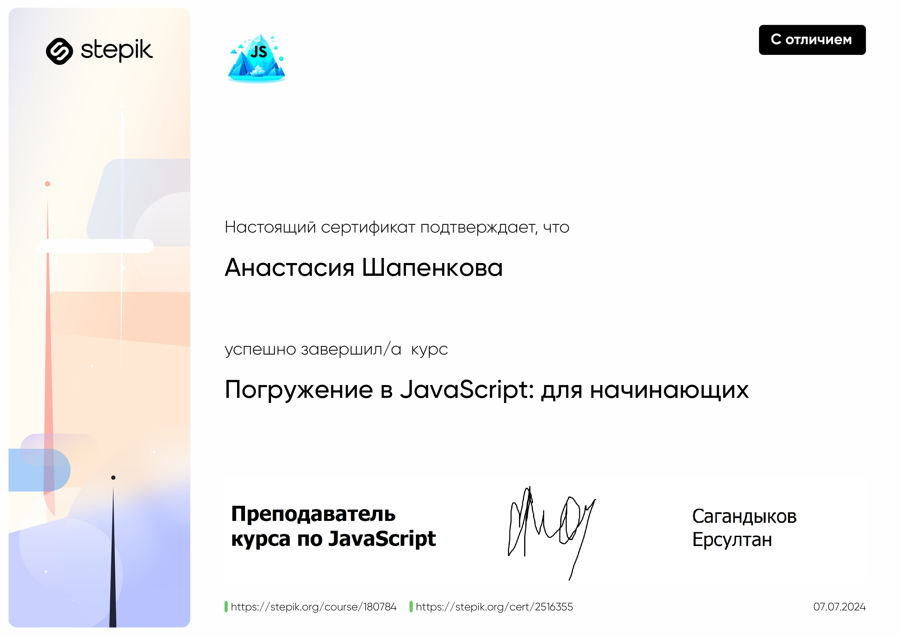](https://stepik.org/cert/2516355)|

---

### Мои работы:

|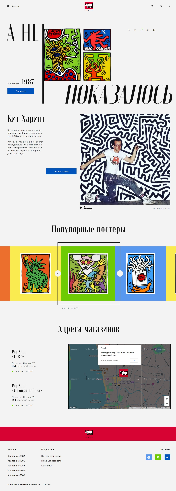|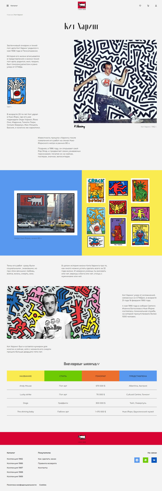|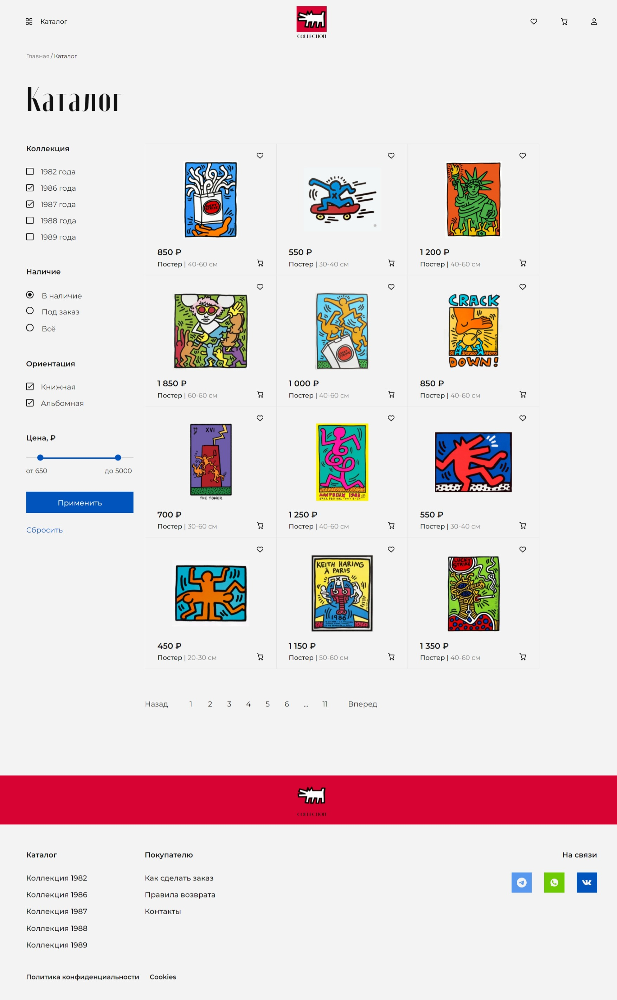|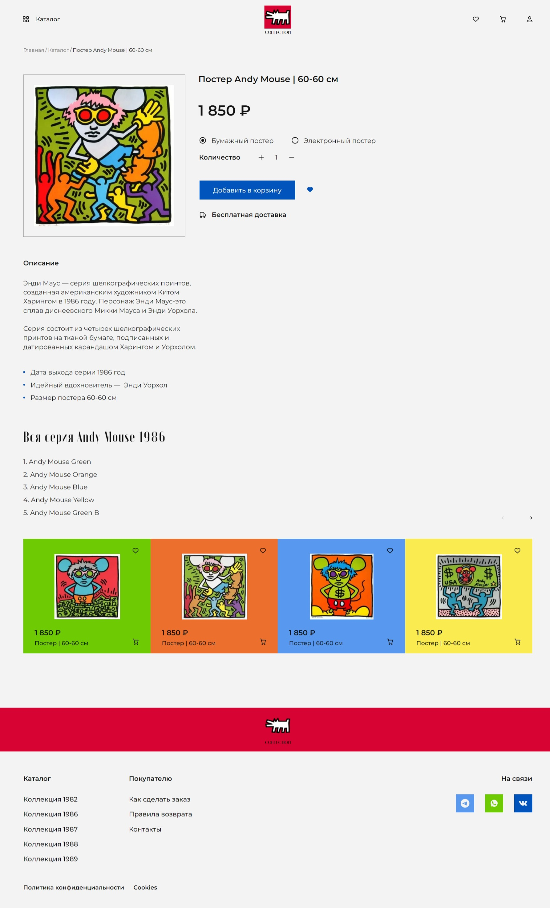|
|:----:|:----:|:----:|:----:|

